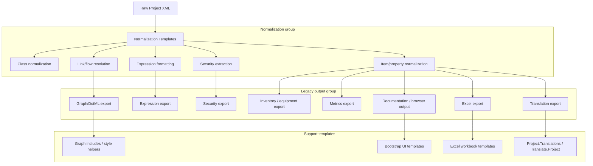

# src-analysis

## 1. Directory tree for `src`

```text
src
├── AnalyseProject.cmd
├── Build
│   ├── Build.Diagram.cmd
│   ├── Build.Diagram.png
│   ├── Build.Files.xml
│   └── BuildToDotML.xslt
├── Clean.cmd
├── External
│   ├── css
│   ├── images
│   └── lib
├── Library
│   ├── bootstrap 2.3.2
│   ├── dotml-1.4
│   ├── exslt
│   ├── GraphViz-2.30.1
│   ├── jquery 1.10.2
│   ├── libxml
│   └── nxslt
├── ProjectAnalysis.sln
└── StyleSheets
    ├── Authstore.Normalize.xslt
    ├── Bootstrap.CodeItems.xslt
    ├── Bootstrap.Common.xslt
    ├── Bootstrap.Downtime.xslt
    ├── Bootstrap.EquipmentIds.xslt
    ├── Bootstrap.Planning.xslt
    ├── Bootstrap.ReportingPoints.xslt
    ├── Bootstrap.Variables.xslt
    ├── Common.Graphs.DotML.xslt
    ├── Document.Browser.Testing.xslt
    ├── Document.Browser.xslt
    ├── Document.CodeItems.xslt
    ├── Document.Common.xslt
    ├── Document.Downtime.xslt
    ├── Document.Equipment.xslt
    ├── Document.Expressions.DotML.xslt
    ├── Document.Frames.xslt
    ├── Document.Graphs.DotML.xslt
    ├── Document.Hierarchy.xslt
    ├── Document.Interfaces.xslt
    ├── Document.Inventory.DotML.xslt
    ├── Document.Inventory.Materials.DotML.xslt
    ├── Document.ItemTypes.xslt
    ├── Document.Metrics.DotML.xslt
    ├── Document.Metrics.Mindmap.xslt
    ├── Document.Metrics.Report.xslt
    ├── Document.Metrics.xslt
    ├── Document.OleDb.xslt
    ├── Document.Properties.Common.xslt
    ├── Document.Properties.ExtraInfo.xslt
    ├── Document.Properties.xslt
    ├── Document.Security.Text.xslt
    ├── Document.Security.xslt
    ├── Document.Summary.xslt
    ├── Document.Translations.xslt
    ├── Document.Warnings.xslt
    ├── Excel.Calendar.xslt
    ├── Excel.Common.xslt
    ├── Excel.Connectors.xslt
    ├── Excel.Downtime.xslt
    ├── Excel.Expressions.xslt
    ├── Excel.Modules.Downtime.xslt
    ├── Excel.Modules.Metrics.xslt
    ├── Excel.Modules.Production.xslt
    ├── Excel.Modules.Quality.xslt
    ├── Excel.Property.Tables.xslt
    ├── Excel.Security.xslt
    ├── Excel.Types.xslt
    ├── File.ItemId.Fullname.Type.xslt
    ├── FormatStrings.xml
    ├── Freemind.xsd
    ├── Include.Graphs.Colours.xslt
    ├── Include.Graphs.Database2Ampla.xslt
    ├── Include.Graphs.Defaults.xslt
    ├── Include.Graphs.File2Ampla.xslt
    ├── Include.Graphs.Metrics.xslt
    ├── Include.Graphs.Project.xslt
    ├── Include.Graphs.ReportingPoint.xslt
    ├── Project.Downtime.xslt
    ├── Project.Equipment.xslt
    ├── Project.Expressions.xslt
    ├── Project.Flow.xslt
    ├── Project.Inventory.xslt
    ├── Project.LinkFrom.xslt
    ├── Project.LinkTo.xslt
    ├── Project.Metrics.xslt
    ├── Project.Mindmap(0.8.1).xslt
    ├── Project.Normalize.xslt
    ├── Project.OLEDB.xslt
    ├── Project.RDF.xslt
    ├── Project.Security.xslt
    ├── Project.Translations.xslt
    ├── Stylesheets.csproj
    └── Translate.Project.xslt
```

> Note: `src/External` and `src/Library` contain third-party UI, GraphViz, libxml/libxslt and runtime libraries. The main legacy transformation logic lives under `src/Build` and `src/StyleSheets`.

## 2. XSLT classification by purpose

### Normalization
- `src/StyleSheets/Authstore.Normalize.xslt`
- `src/StyleSheets/Project.Normalize.xslt`
- `src/StyleSheets/Project.Translations.xslt`
- `src/StyleSheets/Translate.Project.xslt`
- `src/StyleSheets/File.ItemId.Fullname.Type.xslt`

### Flow / links / graph construction
- `src/StyleSheets/Project.Flow.xslt`
- `src/StyleSheets/Project.LinkFrom.xslt`
- `src/StyleSheets/Project.LinkTo.xslt`
- `src/Build/BuildToDotML.xslt`
- `src/StyleSheets/Project.Mindmap(0.8.1).xslt`
- `src/StyleSheets/Common.Graphs.DotML.xslt`
- `src/StyleSheets/Document.Graphs.DotML.xslt`
- `src/StyleSheets/Include.Graphs.*.xslt`

### Security
- `src/StyleSheets/Project.Security.xslt`
- `src/StyleSheets/Excel.Security.xslt`
- `src/StyleSheets/Document.Security.xslt`
- `src/StyleSheets/Document.Security.Text.xslt`

### Expressions
- `src/StyleSheets/Project.Expressions.xslt`
- `src/StyleSheets/Document.Expressions.DotML.xslt`
- `src/StyleSheets/Excel.Expressions.xslt`

### Inventory / equipment / item catalogs
- `src/StyleSheets/Project.Inventory.xslt`
- `src/StyleSheets/Project.Equipment.xslt`
- `src/StyleSheets/Document.Inventory.DotML.xslt`
- `src/StyleSheets/Document.Inventory.Materials.DotML.xslt`
- `src/StyleSheets/Document.Equipment.xslt`

### Metrics / reporting
- `src/StyleSheets/Project.Metrics.xslt`
- `src/StyleSheets/Document.Metrics.xslt`
- `src/StyleSheets/Document.Metrics.DotML.xslt`
- `src/StyleSheets/Document.Metrics.Mindmap.xslt`
- `src/StyleSheets/Document.Metrics.Report.xslt`
- `src/StyleSheets/Excel.Modules.Metrics.xslt`
- `src/StyleSheets/Include.Graphs.Metrics.xslt`

### Excel export
- `src/StyleSheets/Excel.Calendar.xslt`
- `src/StyleSheets/Excel.Common.xslt`
- `src/StyleSheets/Excel.Connectors.xslt`
- `src/StyleSheets/Excel.Downtime.xslt`
- `src/StyleSheets/Excel.Expressions.xslt`
- `src/StyleSheets/Excel.Modules.Downtime.xslt`
- `src/StyleSheets/Excel.Modules.Metrics.xslt`
- `src/StyleSheets/Excel.Modules.Production.xslt`
- `src/StyleSheets/Excel.Modules.Quality.xslt`
- `src/StyleSheets/Excel.Property.Tables.xslt`
- `src/StyleSheets/Excel.Security.xslt`
- `src/StyleSheets/Excel.Types.xslt`

### Documentation / HTML / report generation
- `src/StyleSheets/Document.Browser.Testing.xslt`
- `src/StyleSheets/Document.Browser.xslt`
- `src/StyleSheets/Document.CodeItems.xslt`
- `src/StyleSheets/Document.Common.xslt`
- `src/StyleSheets/Document.Downtime.xslt`
- `src/StyleSheets/Document.Frames.xslt`
- `src/StyleSheets/Document.Hierarchy.xslt`
- `src/StyleSheets/Document.Interfaces.xslt`
- `src/StyleSheets/Document.ItemTypes.xslt`
- `src/StyleSheets/Document.OleDb.xslt`
- `src/StyleSheets/Document.Properties.Common.xslt`
- `src/StyleSheets/Document.Properties.ExtraInfo.xslt`
- `src/StyleSheets/Document.Properties.xslt`
- `src/StyleSheets/Document.Summary.xslt`
- `src/StyleSheets/Document.Translations.xslt`
- `src/StyleSheets/Document.Warnings.xslt`
- `src/StyleSheets/Document.Security.xslt`
- `src/StyleSheets/Document.Security.Text.xslt`

### UI / bootstrap / HTML scaffolding
- `src/StyleSheets/Bootstrap.Common.xslt`
- `src/StyleSheets/Bootstrap.CodeItems.xslt`
- `src/StyleSheets/Bootstrap.Downtime.xslt`
- `src/StyleSheets/Bootstrap.EquipmentIds.xslt`
- `src/StyleSheets/Bootstrap.Planning.xslt`
- `src/StyleSheets/Bootstrap.ReportingPoints.xslt`
- `src/StyleSheets/Bootstrap.Variables.xslt`

### Other / support
- `src/StyleSheets/FormatStrings.xml`
- `src/StyleSheets/Freemind.xsd`
- `src/StyleSheets/Stylesheets.csproj`

## 3. Responsibilities of each group

### Normalization
- Translate raw project XML into an intermediate normalized document tree.
- Resolve class definitions, item definitions, IDs, full names, and translations.
- Provide a stable foundation for downstream flows, security, expressions, and export.

### Flow / linking
- Resolve item-to-item relationships and build explicit forward/backward graphs.
- Create flow-related outputs such as `linkFrom`, `linkTo`, and DotML graph representations.
- Support `Project.Flow`, link resolution, and mindmap/graph generation.

### Security
- Extract access control structures, users, scopes, identities, and permission inheritance.
- Format security output for both document and Excel targets.
- Support textual and structured security export.

### Expressions
- Format and normalize expression definitions.
- Resolve item references inside `ExpressionConfig` blocks to full project names.
- Feed normalized expression text to reporting and analysis outputs.

### Inventory / equipment
- Generate inventory views and equipment-specific exports.
- Render structured material and inventory reports.
- Support equipment-oriented property normalization and item grouping.

### Metrics / reporting
- Build metrics-specific documents, DotML graph outputs, mindmaps, and Excel modules.
- Produce both summary-level and detailed metric representations.
- Link metrics output into the broader project documentation pipeline.

### Excel export
- Transform normalized XML into Excel-compatible worksheets.
- Provide specialized export logic for calendars, connectors, downtime, security, and property tables.
- Use Excel-specific templates to build module-level spreadsheet views.

### Documentation / report generation
- Render HTML/structured documentation for browser-based and printable output.
- Provide templates for browser, summary, warnings, item types, properties, hierarchies, and more.
- Combine normalized data with UI scaffolding from `Bootstrap.*` templates.

### UI / bootstrap / HTML scaffolding
- Provide shared page layout, navigation, and formatting for document outputs.
- Support code item listings, planning views, reports, and variable/security dashboards.

### Graph generation / DotML
- Create DotML outputs used by GraphViz or mindmap viewers.
- Supply graph defaults, colour schemes, and Ampla-specific graph transformations.
- Enable project graph export and visualization of relationships.

## 4. Missing / unimplemented functionality compared to `ampla_project`

The Python package implements the core normalization pipeline, but `src` contains many legacy presentation templates that are not mirrored by Python modules.

### Implemented in Python
- `Project.Normalize.xslt` → `ampla_project.normalize.normalize`
- generic item normalization → `ampla_project.normalize.items`
- class normalization → `ampla_project.normalize.classes`
- property normalization → `ampla_project.normalize.properties`
- link resolution / `linkFrom` / `linkTo` → `ampla_project.normalize.links`
- expressions / `ExpressionConfig` formatting → `ampla_project.normalize.expressions`
- flow graph creation → `ampla_project.normalize.flow`
- security extraction → `ampla_project.normalize.security`
- normalization context, translation loading, platform version extraction → `ampla_project.normalize.context`

### Not implemented in Python
- Most output-generation XSLT: `Document.*`, `Excel.*`, `Bootstrap.*`, `Project.*` exports such as RDF/OLEDB/Downtime/Equipment/Translations/Mindmap.
- Graph/DotML generation: `BuildToDotML.xslt`, `Common.Graphs.DotML.xslt`, `Document.Graphs.DotML.xslt`, `Include.Graphs.*.xslt`, `Project.Mindmap(0.8.1).xslt`.
- Excel-specific workbook rendering and module exports.
- Browser/document UI rendering and HTML scaffolding.
- Export helpers for OleDb, RDF, and translated output documents.
- `Authstore.Normalize.xslt` and project translation transform templates.

### Missing Python coverage relative to old XSLT architecture
- There is no Python module dedicated to `authstore` or legacy translation transforms from `src/StyleSheets/Authstore.Normalize.xslt`.
- The Python package does not implement any of the report-generation and export templates present under `src/StyleSheets/Document.*` and `src/StyleSheets/Excel.*`.
- Graph rendering and DotML generation are absent in Python; these are still only in XSLT (`BuildToDotML.xslt`, `Common.Graphs.DotML.xslt`, etc.).
- The legacy `Project.OLEDB.xslt`, `Project.RDF.xslt`, and `Document.OleDb.xslt` exports are not represented in `ampla_project`.
- No Python equivalent exists for `Project.Equipment.xslt`, `Project.Downtime.xslt`, and the equipment/inventory-specific export templates.

## 5. Proposed mapping: XSLT file → Python module(s) / status

### Normalization and core pipeline
| XSLT file | Category | Python module(s) / status |
|---|---|---|
| `src/StyleSheets/Project.Normalize.xslt` | normalization | `ampla_project.normalize.normalize` |
| `src/StyleSheets/Authstore.Normalize.xslt` | normalization | not implemented |
| `src/StyleSheets/Project.Translations.xslt` | normalization / translation | not implemented |
| `src/StyleSheets/Translate.Project.xslt` | normalization / translation | not implemented |
| `src/StyleSheets/File.ItemId.Fullname.Type.xslt` | normalization helper | not implemented |

### Items, properties, and inventory
| XSLT file | Category | Python module(s) / status |
|---|---|---|
| `src/StyleSheets/Project.Inventory.xslt` | inventory | partial: `ampla_project.normalize.items`, `ampla_project.normalize.properties` |
| `src/StyleSheets/Project.Equipment.xslt` | equipment | not implemented |
| `src/StyleSheets/Document.Inventory.DotML.xslt` | inventory export | not implemented |
| `src/StyleSheets/Document.Inventory.Materials.DotML.xslt` | inventory export | not implemented |
| `src/StyleSheets/Document.Equipment.xslt` | equipment export | not implemented |

### Flow and links
| XSLT file | Category | Python module(s) / status |
|---|---|---|
| `src/StyleSheets/Project.Flow.xslt` | flow graph | `ampla_project.normalize.flow` |
| `src/StyleSheets/Project.LinkFrom.xslt` | link forward | `ampla_project.normalize.links.build_link_from_to` |
| `src/StyleSheets/Project.LinkTo.xslt` | link reverse | `ampla_project.normalize.links.build_link_from_to` |
| `src/Build/BuildToDotML.xslt` | graph export | not implemented |
| `src/StyleSheets/Project.Mindmap(0.8.1).xslt` | mindmap / graph | not implemented |

### Expressions
| XSLT file | Category | Python module(s) / status |
|---|---|---|
| `src/StyleSheets/Project.Expressions.xslt` | expressions | `ampla_project.normalize.expressions` |
| `src/StyleSheets/Document.Expressions.DotML.xslt` | expression export | not implemented |
| `src/StyleSheets/Excel.Expressions.xslt` | expression export | not implemented |

### Security
| XSLT file | Category | Python module(s) / status |
|---|---|---|
| `src/StyleSheets/Project.Security.xslt` | security | `ampla_project.normalize.security` |
| `src/StyleSheets/Excel.Security.xslt` | security export | not implemented |
| `src/StyleSheets/Document.Security.xslt` | security export | not implemented |
| `src/StyleSheets/Document.Security.Text.xslt` | security text | not implemented |

### Metrics and reporting
| XSLT file | Category | Python module(s) / status |
|---|---|---|
| `src/StyleSheets/Project.Metrics.xslt` | metrics | not implemented |
| `src/StyleSheets/Document.Metrics.xslt` | metrics export | not implemented |
| `src/StyleSheets/Document.Metrics.DotML.xslt` | metrics graph | not implemented |
| `src/StyleSheets/Document.Metrics.Mindmap.xslt` | mindmap export | not implemented |
| `src/StyleSheets/Document.Metrics.Report.xslt` | metrics report | not implemented |
| `src/StyleSheets/Excel.Modules.Metrics.xslt` | Excel metrics | not implemented |
| `src/StyleSheets/Include.Graphs.Metrics.xslt` | graph helper | not implemented |

### Excel export
| XSLT file | Category | Python module(s) / status |
|---|---|---|
| `src/StyleSheets/Excel.Calendar.xslt` | Excel export | not implemented |
| `src/StyleSheets/Excel.Common.xslt` | Excel export | not implemented |
| `src/StyleSheets/Excel.Connectors.xslt` | Excel export | not implemented |
| `src/StyleSheets/Excel.Downtime.xslt` | Excel export | not implemented |
| `src/StyleSheets/Excel.Modules.Downtime.xslt` | Excel export | not implemented |
| `src/StyleSheets/Excel.Modules.Production.xslt` | Excel export | not implemented |
| `src/StyleSheets/Excel.Modules.Quality.xslt` | Excel export | not implemented |
| `src/StyleSheets/Excel.Property.Tables.xslt` | Excel export | not implemented |
| `src/StyleSheets/Excel.Security.xslt` | Excel export | not implemented |
| `src/StyleSheets/Excel.Types.xslt` | Excel export | not implemented |

### Documentation and HTML / UI
| XSLT file | Category | Python module(s) / status |
|---|---|---|
| `src/StyleSheets/Document.Browser.xslt` | documentation | not implemented |
| `src/StyleSheets/Document.Browser.Testing.xslt` | documentation | not implemented |
| `src/StyleSheets/Document.CodeItems.xslt` | documentation | not implemented |
| `src/StyleSheets/Document.Common.xslt` | documentation | not implemented |
| `src/StyleSheets/Document.Downtime.xslt` | documentation | not implemented |
| `src/StyleSheets/Document.Frames.xslt` | documentation | not implemented |
| `src/StyleSheets/Document.Hierarchy.xslt` | documentation | not implemented |
| `src/StyleSheets/Document.Interfaces.xslt` | documentation | not implemented |
| `src/StyleSheets/Document.ItemTypes.xslt` | documentation | not implemented |
| `src/StyleSheets/Document.OleDb.xslt` | documentation / OLEDB export | not implemented |
| `src/StyleSheets/Document.Properties.Common.xslt` | documentation | not implemented |
| `src/StyleSheets/Document.Properties.ExtraInfo.xslt` | documentation | not implemented |
| `src/StyleSheets/Document.Properties.xslt` | documentation | not implemented |
| `src/StyleSheets/Document.Summary.xslt` | documentation | not implemented |
| `src/StyleSheets/Document.Translations.xslt` | documentation | not implemented |
| `src/StyleSheets/Document.Warnings.xslt` | documentation | not implemented |
| `src/StyleSheets/Bootstrap.Common.xslt` | UI | not implemented |
| `src/StyleSheets/Bootstrap.CodeItems.xslt` | UI | not implemented |
| `src/StyleSheets/Bootstrap.Downtime.xslt` | UI | not implemented |
| `src/StyleSheets/Bootstrap.EquipmentIds.xslt` | UI | not implemented |
| `src/StyleSheets/Bootstrap.Planning.xslt` | UI | not implemented |
| `src/StyleSheets/Bootstrap.ReportingPoints.xslt` | UI | not implemented |
| `src/StyleSheets/Bootstrap.Variables.xslt` | UI | not implemented |

### Graph helpers and includes
| XSLT file | Category | Python module(s) / status |
|---|---|---|
| `src/StyleSheets/Common.Graphs.DotML.xslt` | graph / DotML | not implemented |
| `src/StyleSheets/Document.Graphs.DotML.xslt` | graph / DotML | not implemented |
| `src/StyleSheets/Include.Graphs.Colours.xslt` | graph helper | not implemented |
| `src/StyleSheets/Include.Graphs.Database2Ampla.xslt` | graph helper | not implemented |
| `src/StyleSheets/Include.Graphs.Defaults.xslt` | graph helper | not implemented |
| `src/StyleSheets/Include.Graphs.File2Ampla.xslt` | graph helper | not implemented |
| `src/StyleSheets/Include.Graphs.Project.xslt` | graph helper | not implemented |
| `src/StyleSheets/Include.Graphs.ReportingPoint.xslt` | graph helper | not implemented |

### Other export targets
| XSLT file | Category | Python module(s) / status |
|---|---|---|
| `src/StyleSheets/Project.Downtime.xslt` | export target | not implemented |
| `src/StyleSheets/Project.OLEDB.xslt` | export target | not implemented |
| `src/StyleSheets/Project.RDF.xslt` | export target | not implemented |

## 6. High-level Mermaid diagram of the old XSLT architecture


